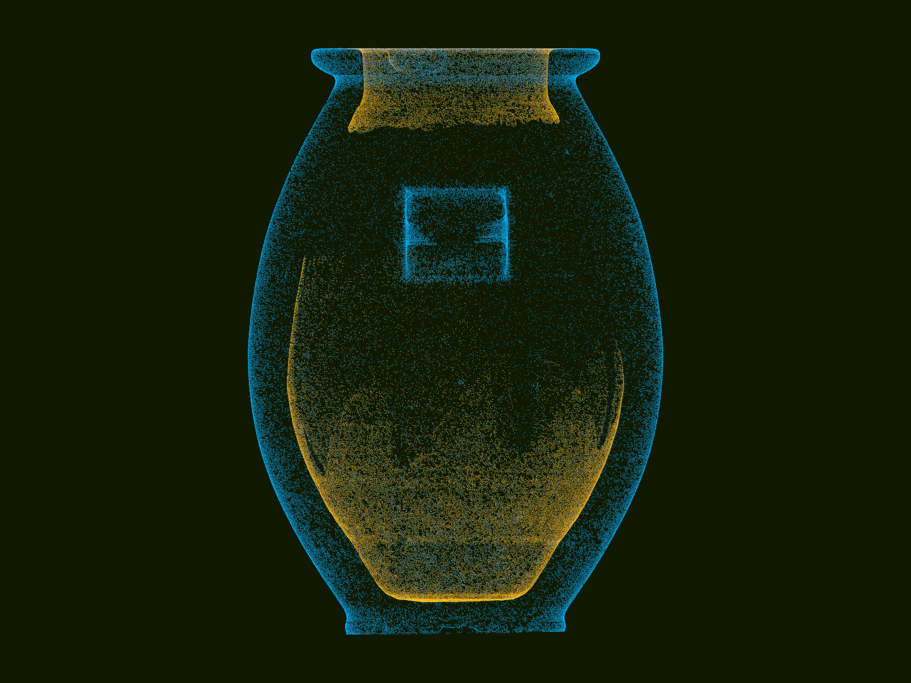

# Predynastic-Egyptian-granite-vase
Data extracted from STL file from scan of the vase together with some [POV-Ray](http://www.povray.org) SDL code

The data was converted from the STL file that can be found here:
https://unchartedx.com/site/wp-content/uploads/2023/02/Vase.stl

Here is the page about the scan and the STL file:
https://unchartedx.com/site/2023/02/19/new-video-updates-to-the-vase-scan-responses-and-the-stl-file/

## Images created with the POV-Ray examples:

### Vase
[Source code](POV-Ray_files/Vase.pov)\

### Vase Inside & Outside Direction +X
[Source code](POV-Ray_files/Vase_Inside_Outside_Dir_PosX.pov)\

### Vase Inside & Outside Direction +Z
[Source code](POV-Ray_files/Vase_Inside_Outside_Dir_PosZ.pov)\

### Vase Inside & Outside Direction -Y
[Source code](POV-Ray_files/Vase_Inside_Outside_Dir_NegY.pov)\

### Vase Clipped
[Source code](POV-Ray_files/Vase_Clipped.pov)\

### Vase Radii
[Source code](POV-Ray_files/Vase_Radii.pov)\

### Vase Edges
[Source code](POV-Ray_files/Vase_Edges.pov)\

### Vase Vertex Normals
[Source code](POV-Ray_files/Vase_Vertex_Normals.pov)\

### Vase Radii Heights Angles
[Source code](POV-Ray_files/Vase_Radii_Heights_Angles.pov)\

### Vase Mesh Inside Outside
[Source code](POV-Ray_files/Vase_Mesh_Inside_Outside.pov)\

### Project homepage

https://github.com/t-o-k/Predynastic-Egyptian-granite-vase/

### Author

[Tor Olav Kristensen](http://subcube.com)
